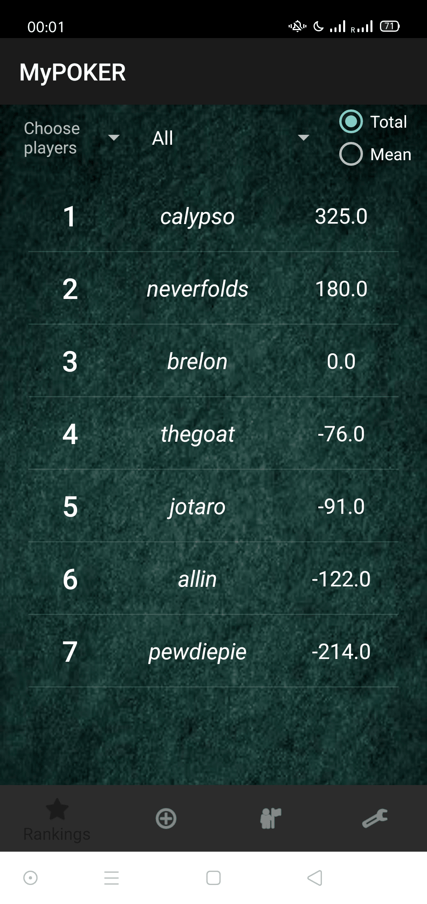
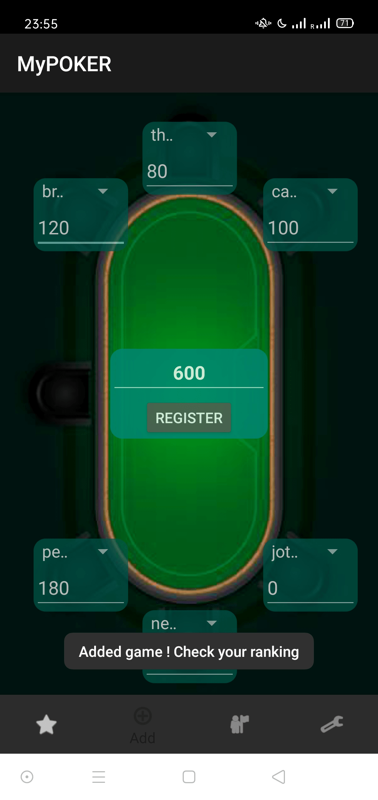
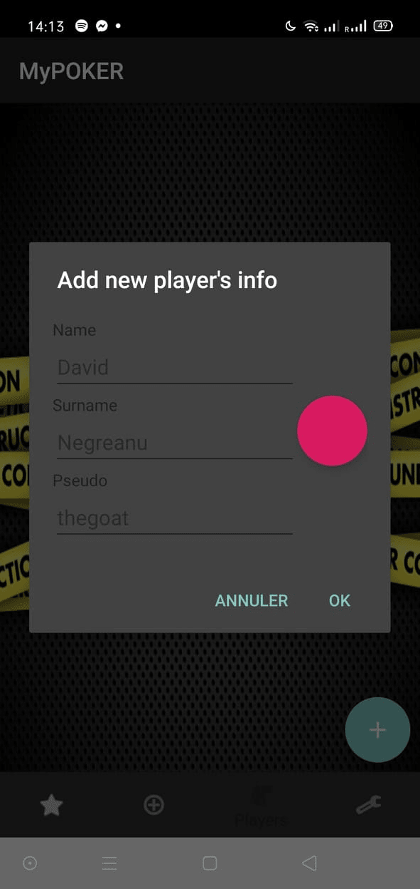

# MyPoker

#### MyPoker is a highly simplified personal-utility Android application that can be used to keep track of poker games between friends. 

 - The interface is straightforward where one can :
      1) see his ranking over multiple instance of **time intervals** (Last game / Last 3 games / Last 7 games / All ).
      2) Choose the **players** he wants to include in the ratings
      3) Choose either to have the **total** gains (or losses) up until now or the **mean**

 - One can easily add a game in a 6MAX (or less) configuration table by putting the total amount played on in the middle and the amounts each player have at the end of the game.
The application **registers** the game only if the amounts sum correctly to the total and no player is used twice.

 - Adding a player is done via the third widget (Name, surname and **pseudo** are required)

### Code in Android Studio

